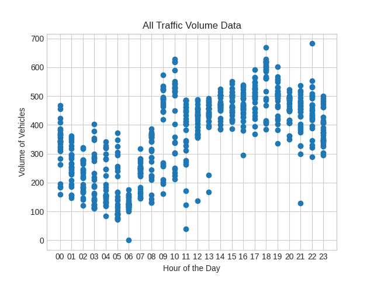
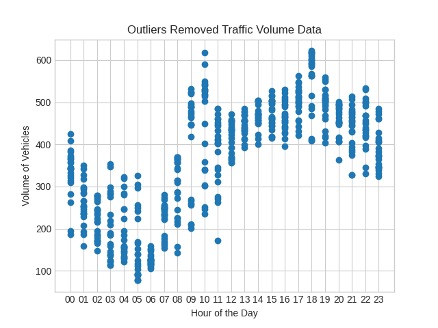
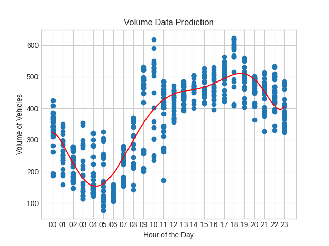
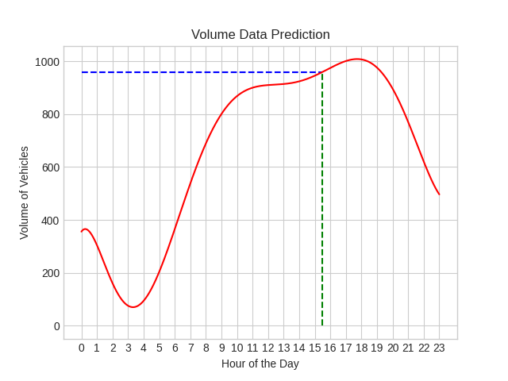

# 🚦 Traffic Analysis using Linear Regression 🚦

This repository contains [Jupyter Notebooks](https://jupyter.org/) for doing data analysis on the traffic volumes of Dublin junctions.  
The notebooks were created using the notebooks available in the [Python Data Science Handbook Github Repository](https://github.com/jakevdp/PythonDataScienceHandbook).

### Libraries

The following libraries were used to process the data:

- [Pandas](https://pandas.pydata.org/) — Loading data, saving models
- [Numpy](https://numpy.org/) — Processing data
- [Matplotlib Pyplot](https://matplotlib.org/stable/) — Visualising results
- [Scikit Learn](https://scikit-learn.org/stable/) — Training model

### Data

The Dublin traffic volume data was downloaded from [data.gov.ie](https://data.gov.ie/dataset/dcc-scats-detector-volume-jan-jun-2023), from which many other similar sets of data can be downloaded. The data downloaded contains the following columns:

- **End_Time** - The hour at which the period ends, includes year, month, day, hour.
- **Region** - Geographic region of the site.
- **Site** - The number of the site.
- **Detector** - The number of each detectors at each site.
- **Sum_Volume** - The total number of vehicles recorded in the previous hour.
- **Avg_Volume** - The average of the number of vehicles recorded in the past hour for each 5 minute intervals.

### Process

The following procedure is then used in the [Notebook](Notebooks/LinearRegressionTrafficVolume.ipynb) to process and visualise the data:

1. The data is imported, column **Detector** is omitted.
2. All of the **Detector** row values for **Sum_Volume** and **Avg_Volume** are summed up to get only 1 per **Site** per **End_Time**.  
   Multiprocessing was used to concurrently process the 900+ sites, bringing the total amount of rows down from 9+ million to about 611 thousand.

3. The summed up data is saved in a new CSV file, and loaded in for the next steps.
4. The **End_Time** data is converted into **End_Day** and **End_Hour**, and the whole data set is then sorted according to the **End_HOUR**.
5. A specific **Site** data is cleaned removing top and bottom 5% of data for each hour.

   _Graph showing all data points for Site 782:_  
   

   _Graph showing cleaned data points for Site 782:_  
   

6. An 8-th degree Polynomial model is created and trained on the **Site** data, using the **End_Hour** and the **Sum_Volume**, which is then saved.

   _Graph showing the model with data for Site 782:_  
   

7. The code can then be ran for all **Sites** which have at least one data point for each hour, and the models are then saved.
8. Specified site model is loaded in, and time to predict traffic volume is also taken in. The model than predicts a value and shows the result.

   _Prediction Graph for Site 408 at 15:30 is showing 960:_  
   

### Application

Using these models generated and using the [SCATS site location data](https://data.gov.ie/dataset/traffic-signals-and-scats-sites-locations-dcc) the **Site** numbers in the data set can be used to see which models are for which junctions throughout the city of Dublin.  
This could then be used to build a heat map of the city showing where there is more or less anticipated traffic, and would help with navigating around the city.
